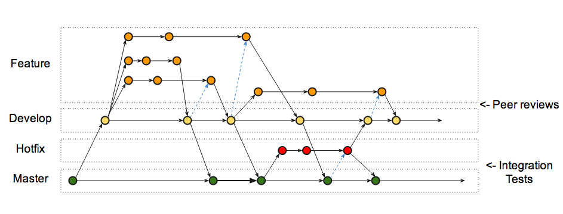

# Возможности *fork*:

+ Форк сохраняет связь с проектом-родителем, по которой он может получить изменения из проекта-родителя;
+ Форк сохраняет связь с проектом-родителем, по которой он может передать изменения в проект-родитель. Это используется в модели ветвления *Forking Workflow*.

В функционале *Git* создание форка не предусмотрено изначально — нет команды `git fork [что-то]`, которая позволит вам создать свой форк. Да и быть не может. Но есть возможность работать с удаленными репозиториями, благодаря которой различные хостинги IT-проектов реализовывают функционал создания форка.

На **GitHub* форк создаётся с помощью кнопки *«fork»*, которая расположена в интерфейсе при просмотре чужих проектов.

